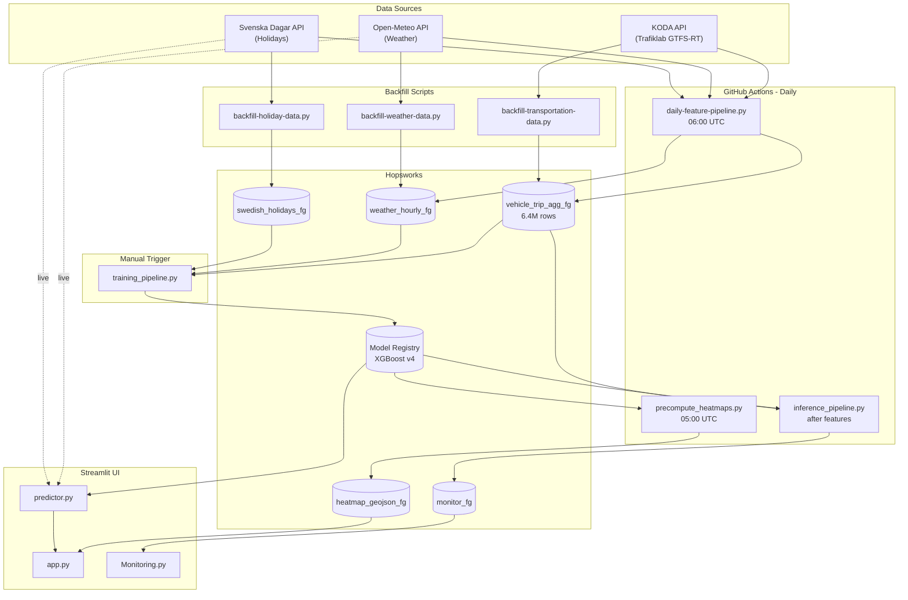
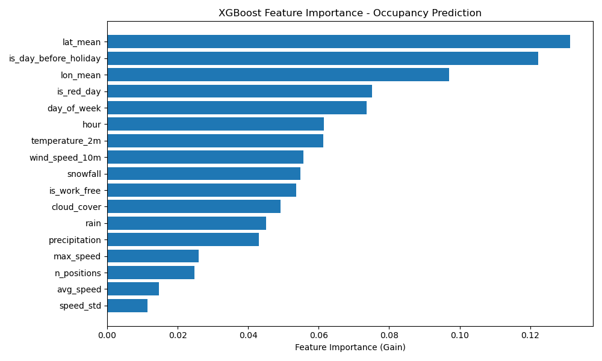

# HappySardines

A service for predicting bus and tram crowding levels in Östergötland, Sweden. Built with serverless machine learning and automated daily workflows.

**[Try the live demo](https://huggingface.co/spaces/AxelHolst/HappySardines)** (monitoring dashboard available via sidebar)

## Motivation

Public transportation plays an important role in society's green transition, how people move and interact, and in making communities less car dependent. However, crowded buses and trams lead to discomfort and can increase the spread of infections. City planners also benefit from knowing which trips have higher or lower utilization, as this can inform timetable adjustments and infrastructure decisions.

Since December 2022, the Trafiklab initiative has provided occupancy data for Östgötatrafiken's vehicles through their GTFS Regional API. There have been business intelligence initiatives to visualize and forecast congestion trends, but mostly at a proof-of-concept level. This project builds on that data with a scalable machine learning forecasting service that could serve as an example application.

This project was built by Kajsa Lidin and Axel Barck-Holst as a final project for the course ID2223 Scalable Machine Learning and Deep Learning at KTH.

## Table of Contents

- [Architecture](#architecture)
- [Data Sources](#data-sources)
  - [KODA API - Bus and Tram Data](#koda-api---bus-and-tram-data)
  - [Open-Meteo - Weather](#open-meteo---weather)
  - [Svenska Dagar - Swedish Holidays](#svenska-dagar---swedish-holidays)
  - [Trafikverket - Traffic Incidents (Dropped)](#trafikverket---traffic-incidents-dropped)
- [Feature Engineering](#feature-engineering)
  - [Data Aggregation](#data-aggregation)
  - [Selected Features](#selected-features)
  - [Feature Importance](#feature-importance)
- [Class Imbalance: The Main Challenge](#class-imbalance-the-main-challenge)
  - [The Problem](#the-problem)
  - [The Solution](#the-solution)
- [Model](#model)
  - [Why XGBoost](#why-xgboost)
  - [Training Approach](#training-approach)
  - [Performance](#performance-model-v4)
- [Pipelines](#pipelines)
  - [Feature Pipeline](#feature-pipeline-daily-feature-pipelinepy)
  - [Training Pipeline](#training-pipeline-training_pipelinepy)
  - [Heatmap Pipeline](#heatmap-pipeline-uiprecompute_heatmapspy)
  - [Inference Pipeline](#inference-pipeline-inference_pipelinepy)
- [User Interface](#user-interface)
  - [Features](#features)
  - [Monitoring Dashboard](#monitoring-dashboard)
- [Setup](#setup)
  - [Dependencies](#dependencies)
  - [Required API Keys](#required-api-keys)
  - [Environment Setup](#environment-setup)
- [Contributing](#contributing)
- [Contact](#contact)

## Architecture



**Key data flows:**
- **Batch predictions** (heatmap): Model predicts 2000 grid cells × 38 time slots daily, stored in `heatmap_geojson_fg`
- **Real-time predictions** (click): User clicks map → `predictor.py` fetches live weather/holidays → model predicts on-demand
- **Monitoring**: `inference_pipeline.py` compares yesterday's predictions to actuals, stores metrics in `monitor_fg`

The system uses [Hopsworks](https://www.hopsworks.ai/) as the central feature store and model registry. All workflow scripts (scheduled and manual) are in `.github/workflows/` and run via GitHub Actions. The pipeline scripts themselves are in `/pipelines`. The UI is deployed on HuggingFace Spaces.

### Hopsworks Feature Store

We use several feature groups to organize our data:

| Feature Group | Description | Primary Key |
|--------------|-------------|-------------|
| `vehicle_trip_agg_fg` | 1-minute aggregated vehicle metrics (~6.4M rows) | trip_id, window_start |
| `weather_hourly_fg` | Hourly weather data | timestamp, latitude, longitude |
| `swedish_holidays_fg` | Swedish calendar with holiday flags (2 years) | date |
| `heatmap_geojson_fg` | Precomputed prediction grids for UI | hour, weekday |
| `static_trip_info_fg` | GTFS static route/trip information | trip_id, feed_date |

The training pipeline creates a Feature View (`occupancy_fv`) that joins vehicle, weather, and holiday data, with `occupancy_mode` as the prediction label.

## Data Sources

### KODA API - Bus and Tram Data

From the [Trafiklab GTFS Regional API](https://www.trafiklab.se/api/our-apis/koda/), we fetch real-time vehicle positions. The data arrives as 7z-compressed protobuf files containing GTFS-RT VehiclePositions, which we parse using the `gtfs_realtime_pb2` library.

**Raw data includes:**
- `trip_id`, `vehicle_id` - Identifiers
- `latitude`, `longitude` - Position
- `speed`, `bearing` - Movement
- `timestamp` - Unix timestamp (positions every few seconds)
- `occupancy_status` - Our target variable

The raw data provides positions every few seconds, resulting in millions of records per day. To reduce storage and create meaningful training samples, we aggregate into **1-minute windows** keeping min/max/mean positions and the **mode** (most common value) of occupancy status within each window.

We also use KODA's static GTFS data (routes.txt, trips.txt, stops.txt) for route information displayed in the UI.

### Open-Meteo - Weather

From [Open-Meteo](https://open-meteo.com/) (free, no API key required), we retrieve hourly weather data for the Östergötland region centroid (58.13°N, 15.90°E).

**Parameters fetched:**
- `temperature_2m` - Temperature at 2m height (°C)
- `precipitation`, `rain`, `snowfall` - Precipitation types (mm/cm)
- `cloud_cover` - Sky coverage percentage
- `wind_speed_10m`, `wind_gusts_10m` - Wind metrics (km/h)
- `relative_humidity_2m` - Humidity percentage

Both historical data (for training via the Archive API) and forecasts (for predictions via the Forecast API) come from Open-Meteo. Weather features help the model learn seasonal patterns—rainy or cold days tend to drive more people to use public transit.

### Svenska Dagar - Swedish Holidays

From [Svenska Dagar API](https://sholiday.faboul.se/) (free), we get Swedish calendar data:

- `is_work_free` - Whether it's a work-free day (arbetsfri dag)
- `is_red_day` - Official Swedish red day (röd dag) / public holiday
- `is_day_before_holiday` - The day before a holiday (often affects evening travel)
- `holiday_name` - Name of the holiday if applicable

These features turned out to be among the most important predictors. Travel patterns differ dramatically between regular workdays, weekends, and holidays like Midsommar or Christmas.

### Trafikverket - Traffic Incidents (Dropped)

We initially included traffic incident data from [Trafikverket's Situation API](https://data.trafikverket.se/). The hypothesis was that road incidents might cause people to switch from cars to buses, affecting crowding levels.

These features were joined with KODA data to find traffic events near bus locations within a 500m radius. However, after careful analysis, we found:

- **Geographic mismatch**: Trafikverket tracks highways (E4, E6, etc.) while buses operate on urban streets
- **Sparse coverage**: Only 0.02% of trips had any nearby traffic event
- **Zero feature importance**: XGBoost assigned 0.0000 importance to traffic features
- **High computation cost**: Added 75+ minutes to training time

For these reasons, traffic features have been excluded from the model. See [traffic events analysis](./docs/traffic_events_analysis.md) for the full investigation.

## Feature Engineering

### Data Aggregation

The raw GTFS-RT feed provides vehicle positions every few seconds, which would result in hundreds of millions of records. We aggregate this into 1-minute windows per trip:

```python
vehicle_trip_1min_df = (
    rt_df.groupby(["trip_id", "window_start"])
    .agg(
        vehicle_id=("vehicle_id", lambda x: x.mode().iloc[0]),
        avg_speed=("speed", "mean"),
        max_speed=("speed", "max"),
        n_positions=("speed", "count"),  # GPS pings in window
        lat_mean=("position_lat", "mean"),
        lon_mean=("position_lon", "mean"),
        occupancy_mode=("occupancy_status", lambda x: x.mode().iloc[0])
    )
)
```

We use the **mode** for occupancy status to preserve the discrete nature of the labels while getting a representative value for each minute.

### Selected Features

The final features used for training:

| Category | Features | Source |
|----------|----------|--------|
| **Location** | `lat_mean`, `lon_mean` | vehicle_trip_agg_fg |
| **Time** | `hour`, `day_of_week` | vehicle_trip_agg_fg |
| **Vehicle** | `max_speed`, `n_positions` | vehicle_trip_agg_fg |
| **Weather** | `temperature_2m`, `precipitation`, `cloud_cover`, `wind_speed_10m`, `snowfall`, `rain` | weather_hourly_fg |
| **Calendar** | `is_work_free`, `is_red_day`, `is_day_before_holiday` | swedish_holidays_fg |

We dropped `avg_speed` and `speed_std` after finding they had feature importance below 0.02.

### Feature Importance

After training, XGBoost reports feature importance based on gain (how much each feature contributes to reducing prediction error):



The most important features are:
1. **Location** (`lat_mean`, `lon_mean`) - The top individual features; some areas and routes are consistently busier
2. **Calendar features** (`is_day_before_holiday`, `is_red_day`, `is_work_free`) - Holidays fundamentally change travel patterns
3. **Time** (`day_of_week`, `hour`) - Rush hours and weekday vs weekend patterns
4. **Weather** - Temperature, wind, snowfall, and precipitation affect transit usage

## Class Imbalance: The Main Challenge

The occupancy labels follow the [GTFS-RT OccupancyStatus](https://gtfs.org/documentation/realtime/feed-entities/vehicle-positions/) specification:

| Class | Label | % of Training Data |
|-------|-------|-------------------|
| 0 | Empty | 72.3% |
| 1 | Many seats available | 26.3% |
| 2 | Few seats available | 1.0% |
| 3 | Standing room only | 0.4% |
| 4 | Crushed standing room only | Not observed |
| 5 | Full | Not observed |
| 6 | Not accepting passengers | Not observed |

This distribution reflects reality: Swedish buses are usually not crowded. But this creates a machine learning problem—**the classes we care about most (crowded buses) are the rarest**.

Labels 4–6 were entirely absent from our training data, but we kept them in the model configuration (`num_class=7`) in case they appear in future data as the system collects more samples.

### The Problem

Our initial model achieved 76% accuracy by simply **never predicting classes 2 or 3**. It learned that predicting "not crowded" is correct 98.6% of the time. This makes the model useless for its actual purpose—we want to warn users when buses *will* be crowded.

### The Solution

We applied aggressive class weighting to force the model to pay attention to rare classes. First, we compute balanced weights using sklearn, then apply additional multipliers:

```python
CLASS_WEIGHT_MULTIPLIER = {
    0: 1.0,   # EMPTY - baseline
    1: 2.0,   # MANY_SEATS - slight boost
    2: 10.0,  # FEW_SEATS - significant boost
    3: 20.0,  # STANDING - heavy boost
    4: 30.0,  # CRUSHED_STANDING - not observed yet
    5: 30.0,  # FULL - not observed yet
    6: 30.0,  # NOT_ACCEPTING - not observed yet
}
```

A single "standing room only" sample ends up weighted ~3,400x more than an "empty" sample during training. This reduced overall accuracy but dramatically improved recall on the crowded classes:

| Class | Recall (Before) | Recall (After) |
|-------|-----------------|----------------|
| 0 (Empty) | 81% | 59% |
| 1 (Many seats) | 69% | 35% |
| 2 (Few seats) | **0%** | **37%** |
| 3 (Standing) | **0%** | **63%** |

The tradeoff is worth it: false positives (predicting crowded when it's not) cause minor inconvenience, but false negatives (predicting empty when it's packed) mean users make decisions based on bad information.

See [class imbalance analysis](./docs/class_imbalance_analysis.md) for full details including confusion matrices and the mathematical derivation of weights.

## Model

We use an [XGBoost](https://xgboost.readthedocs.io/) classifier for multi-class occupancy prediction. XGBoost is a gradient boosting library commonly used for tabular classification tasks, and provides built-in feature importance which helped us understand what drives predictions.

### Training Approach

- **Temporal split**: 80% train / 20% test split by date (not random), to avoid data leakage from future observations
- **Class weighting**: Aggressive sample weights for minority classes (see above)
- **Probability output**: The model outputs confidence scores for each class, not just hard predictions

### Performance

Model performance metrics are tracked over time in the monitoring dashboard (accessible via the sidebar in the UI). Key metrics include accuracy, per-class recall, and how predictions compare to actual observed occupancy.

## Pipelines

All pipelines are in `/pipelines` and run via GitHub Actions (`.github/workflows/`).

### Feature Pipeline (`daily-feature-pipeline.py`)

**Schedule**: Daily at 06:00 UTC

This pipeline fetches and processes the previous day's data:

1. **Fetch GTFS-RT**: Downloads 24 hours of vehicle position data from KODA (one 7z archive per hour)
2. **Parse protobuf**: Extracts positions, speeds, and occupancy from binary protobuf files
3. **Aggregate**: Groups into 1-minute windows with statistical summaries
4. **Validate**: Runs Great Expectations checks (no null primary keys, etc.)
5. **Fetch weather**: Gets hourly weather from Open-Meteo
6. **Fetch holidays**: Gets calendar info from Svenska Dagar
7. **Upload**: Inserts all data to Hopsworks feature groups

The pipeline handles transient failures with exponential backoff retries.

### Training Pipeline (`training_pipeline.py`)

**Trigger**: Manual (via GitHub Actions workflow dispatch)

1. **Fetch data**: Reads from `vehicle_trip_agg_fg`, `weather_hourly_fg`, `swedish_holidays_fg`
2. **Join features**: Merges on date + hour (weather) and date (holidays)
3. **Split data**: Temporal 80/20 split based on date ordering
4. **Compute weights**: Calculates sample weights for class imbalance
5. **Train model**: Fits XGBClassifier with weighted samples
6. **Evaluate**: Computes accuracy, precision, recall, F1, per-class metrics
7. **Register**: Uploads model to Hopsworks Model Registry with metrics and lineage

**CLI options:**
```bash
python training_pipeline.py --test-start-date 2025-12-01 --no-upload
```

### Heatmap Pipeline (`ui/precompute_heatmaps.py`)

**Schedule**: Daily at 05:00 UTC

To avoid slow on-demand predictions in the UI, we precompute a grid of predictions:

1. **Load model**: Fetches trained model from Hopsworks
2. **Generate grid**: Creates 40×50 = 2000 points covering the region
3. **Batch predict**: Runs predictions for all points across 19 hours × 2 days = 38 time slots
4. **Create GeoJSON**: Converts predictions to colored grid cells
5. **Upload**: Stores GeoJSON strings in `heatmap_geojson_fg`

This takes ~15 minutes but enables instant heatmap loading in the UI.

### Inference Pipeline (`inference_pipeline.py`)

**Schedule**: Runs after feature pipeline completes (via `workflow_run` trigger)

1. **Load model**: Fetches current model from registry
2. **Hindcast**: Compares yesterday's predictions to actual observed occupancy
3. **Calculate metrics**: Accuracy, precision, recall, F1, MAE
4. **Upload**: Stores metrics in `monitor_fg` for the monitoring dashboard

This enables us to track model performance over time and detect drift.

## User Interface

The UI is built with [Streamlit](https://streamlit.io/) and [Folium](https://python-visualization.github.io/folium/) for interactive maps. It's deployed on [HuggingFace Spaces](https://huggingface.co/spaces/AxelHolst/HappySardines).

- **Interactive map**: Click anywhere to get a crowding prediction
- **Heat map overlay**: Toggle to see predicted crowding across the region
- **Time selection**: Choose hour and day (today/tomorrow)
- **Weather and holiday info**: Displays conditions that affect predictions

A monitoring dashboard (via sidebar) tracks model performance over time.

## Setup

### Dependencies

All dependencies are in `requirements.txt`:

```bash
pip install -r requirements.txt
```

Or with uv:
```bash
uv sync
```

**Key dependencies:**
- `hopsworks[python]==4.2.*` - Feature store and model registry
- `xgboost>=2.0.0` - Machine learning model
- `gtfs-realtime-bindings` - Protobuf parsing for GTFS-RT
- `great_expectations==0.18.12` - Data validation
- `streamlit`, `folium` - UI components

### Required API Keys

| Service | Purpose | How to get |
|---------|---------|------------|
| [Hopsworks](https://www.hopsworks.ai/) | Feature store & model registry | Create free account |
| [Trafiklab](https://developer.trafiklab.se/) | KODA API (GTFS-RT data) | Register for API key |
| [Trafikverket](https://data.trafikverket.se/) | Traffic incidents (optional, not used) | Register for API key |

Open-Meteo and Svenska Dagar are free APIs that don't require keys.

### Environment Setup

1. Copy the example environment file:
```bash
cp .env.example .env
```

2. Add your API keys to `.env`:
```
HOPSWORKS_API_KEY=your_key_here
HOPSWORKS_PROJECT=your_project_name
KODA_API_KEY=your_trafiklab_key
TRAFIKVERKET_API_KEY=your_trafikverket_key
```

3. Run any pipeline locally:
```bash
python pipelines/daily-feature-pipeline.py
```

### GitHub Actions Secrets

For automated workflows, add these secrets to your repository:
- `HOPSWORKS_API_KEY`
- `HOPSWORKS_PROJECT`
- `KODA_API_KEY`

## Contributing

1. Clone the repository:
```bash
git clone https://github.com/Kajlid/HappySardines.git
cd HappySardines
```

2. Create a branch for your changes

3. Make changes using [conventional commits](https://www.conventionalcommits.org/en/v1.0.0-beta.4/) (e.g., `feat:`, `fix:`, `docs:`)

4. Open a Pull Request to main

## Contact

Questions or feedback? Open an issue or email kajsalid@kth.se / axelbh@kth.se.
